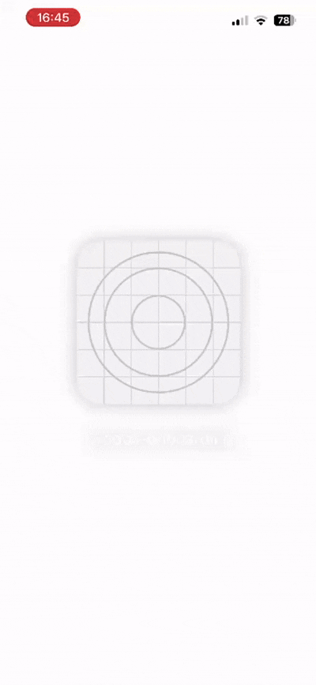

  <h1>Twodos Onboarding</h1>

  

    A small React Native experiment focused on onboarding animations and micro-interactions.
  

  

    Inspired by the Twodos onboarding experience, with a focus on smooth animations,
    timing, gestures, and tactile feedback.
  

  

  

    Onboarding gesture animation showcase.
  

## Highlights

- **60 FPS** animations powered by Reanimated
- **Gesture-driven** onboarding transitions
- **Haptic feedback** synchronized with interactions
- Focus on **smooth, responsive** micro-interactions

## Built with

- React Native
- Expo
- Reanimated
- Expo Haptics

## About

This project is an experimental implementation inspired by the Twodos
onboarding experience.

It was built as a focused exercise in animation and interaction design,
rather than as a full production application.